# python_labs

# Лабораторная работа 1
## Задание 1
```python
a=input("Имя:")
b=int(input("Возраст: "))
c=b+1
print(f"Привет, ",a,"! Через год тебе будет",c)
```
](img/image1/01.png)
## Задание 2
```python
a=input('a: ')
a=a.replace(',','.')
a=float(a)
b=input('b: ')
b=b.replace(',','.')
b=float(b)
print(f"sum={a+b}; avg={(a+b)/2:.2f}")
```
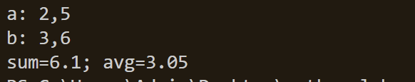](img/image1/02.png)
## Задание 3
```python
price=float(input('цена, р: '))
discount=float(input('скидка, %: '))
vat=float(input('ндс, %:'))
base = price * (1 - discount/100)
vat_amount = base * (vat/100)
total = base + vat_amount
print(f"база после скидки:{base:.2f} р")
print(f"ндс:{vat_amount:.2f} р")
print(f"итого к оплате:{total:.2f} р")
```
](img/image1/03.png)
## Задание 4
```python
m=int(input("минуты: "))
print(f"{m//60}:{m-(60*(m//60)):02d}")
```
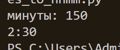](img/image1/04.png)
## Задание 5
```python
name=str(input("ФИО: "))
print(f"инициалы: {(name.split()[0])[0]}{(name.split()[1])[0]}{(name.split()[2])[0]}.")
name=name.replace(' ','')
print(f"длина: {len(name)+2}")
```
]()
## Задание 6
```python
n=int(input('in_1: '))
k=1
och=0
zao=0
for i in range(n):
    k+=1
    name1, name2,voz , obu = (input(f'in{k}: ')).split()
    if obu=="True":
        och+=1
    else:
        zao+=1
print(f'out: {och},{zao}')
```
](img/image1/image.png)


# Лабораторная работа 2
## Задание 1
```python
test1=[3,-1,5,5,0]
test2=[42]
test3=[-5, -2, -9]
test4=[]
test5=[1.5, 2, 2.0, -3.1]
def min_max(nums: list[float | int]) -> tuple[float | int, float | int]:
    #проверка на пустой список
    if len(nums)==0:
        print('ValueError')
    else:
        list2=(min(nums),max(nums))
        print(list2)
print(min_max(test1))
print(min_max(test2))
print(min_max(test3))
print(min_max(test4))
print(min_max(test5))
```

]()

```python
test1=[3, 1, 2, 1, 3] 
test2=[]
test3=[-1, -1, 0, 2, 2]
test4=[1.0, 1, 2.5, 2.5, 0]
def unique_sorted(nums: list[float | int]) -> list[float | int]:
    #создаем 2 списка
    list_int=[]
    list_float=[]
    #разделяю инт и флоат 
    for i in nums:
        if type(i)==int:
            list_int.append(i)
        else:
            list_float.append(i)
    res1=[x for x in list_float if int(x) in list_int]#добавляю флоат если он в инт значении есть в инт списке
    res2=[x for x in list_int if float(x) not in list_float]#добавляю инт если во флоат его нет
    print(sorted(set(res1+res2+list_float)))
print(unique_sorted(test1))
print(unique_sorted(test2))
print(unique_sorted(test3))
print(unique_sorted(test4))
```
]()

```python
test1=[[1, 2], [3, 4]]
test2=([1, 2], (3, 4, 5))
test3=[[1], [], [2, 3]]
test4=[[1, 2], "ab"]

def flatten(mat: list[list | tuple]) -> list:
    #создаю 2 списка чтобы все забрать в списки
    list1=[]
    list2=[]
    count=0
    #перебираю элементы списка/кортежа
    for enum1 in mat:
        #перебираю элементы в элементах..и все добавляю в 1 список
        for enum2 in enum1:
            list1.append(enum2)
            #проверка на матричность элемента
            if type(enum2)==int:
                count+=1
            if count==len(list1):
                list2.append(enum2)
            else:
                print('TypeError')
    if count==len(list1):
        print(list2)

print(flatten(test1))
print(flatten(test2))
print(flatten(test3))
print(flatten(test4))
```
]()

##Задание 2
```python
test1=[[1, 2, 3]]
test2=[[1], [2], [3]] 
test3=[[1, 2], [3, 4]] 
test4=[] 
test5=[[1, 2], [3]]
def transpose(mat: list[list[float | int]]) -> list[list[float | int]]:
    #обработка пустой матрицы
    if not mat:
        return []
    #проверка на равные елементы
    row1st = len(mat[0])
    for row in mat:
        if len(row) != row1st:
            return ("ValueError")
    #транспоз
    transp = []
    for col_index in range(len(mat[0])):
        row_new = []
        for row_index in range(len(mat)):
            row_new.append(mat[row_index][col_index])
        transp.append(row_new)
    return transp
print(transpose(test1))
print(transpose(test2))
print(transpose(test3))
print(transpose(test4))
print(transpose(test5))
```
]()

```python
test1=[[1, 2, 3], [4, 5, 6]] 
test2=[[-1, 1], [10, -10]] 
test3=[[0, 0], [0, 0]] 
test4=[[1, 2], [3]]
def row_sums(mat: list[list[float | int]]) -> list[float]:
    #проверяю на одинак длину элементов
    for i in range(len(mat)-1):
        if len(mat[i])!=len(mat[i+1]):
            print("ValueError")
        else:
            #беру сумму по элементам списка
            return [sum(mat[i]),sum(mat[i+1])]
print(row_sums(test1))
print(row_sums(test2))
print(row_sums(test3))
print(row_sums(test4))          
```
]()

```python
test1=[[1, 2, 3], [4, 5, 6]]
test2=[[-1, 1], [10, -10]] 
test3=[[0, 0], [0, 0]] 
test4=[[1, 2], [3]]
def col_sums(mat: list[list[float | int]]) -> list[float]:
    #проверяю пары из списка на одинак длину
    for enum1 in range(len(mat)-1):
        if len(mat[enum1])!=len(mat[enum1+1]):
            print("ValueError")
        else:
            #беру сумму по каждому столбцу
            list1 = []
            for enum2 in zip(*mat): 
                list1.append(sum(enum2))
    return list1
print(col_sums(test1))
print(col_sums(test2))
print(col_sums(test3))
print(col_sums(test4))
```


## Задание 3

```python
def format_record(rec: tuple[str, str, float]) -> str:
    #проверяю на пустые ячейки
    if len(rec) != 3:
        return ValueError
    #проверяю гпа на правильность
    if not isinstance(rec[2], (int, float)):
        return TypeError
    if rec[2] < 0 or rec[2] > 5.0:
        return ValueError
    #проверяю фио, разделяю и беру только большие буквы
    if type(rec[0]) == str:
        e=rec[0].split()
        #если фи
        if len(e)==2:
            f=e[0].capitalize()+' '+(e[1].capitalize())[0]+'.'
        else:
            f=e[0].capitalize()+' '+ (e[1].capitalize())[0]+'.'+(e[2].capitalize())[0]+'.'
        res=f+','+' гр.'+rec[1] + ', ' + f"{rec[2]:.2f}"
        print(res)
        

test1 = ("Иванов Иван Иванович", "BIVT-25", 4.6)
test2=("Петров Пётр", "IKBO-12", 5.0) 
test3=("Петров Пётр Петрович", "IKBO-12", 5.0) 
test4=("  сидорова  анна   сергеевна ", "ABB-01", 3.999)
test5=( "ABB-01", 3.999)
test6=("Петров Пётр Петрович", "IKBO-12", 6.0) 
print(format_record(test1))
print(format_record(test2)) 
print(format_record(test3)) 
print(format_record(test4))  
print(format_record(test5)) 
print(format_record(test6)) 
```


# Лабораторная работа 3
## Задание 1
```python
testcase1="ПрИвЕт\nМИр\t"
testcase2="ёжик, Ёлка" 
testcase3="Hello\r\nWorld" 
testcase4="  двойные   пробелы  "
import re
def normalize(text: str, *, casefold: bool = True, yo2e: bool = True) -> str:
    # r'\s+' заменяем все все лишние элементы, заменяет на пробел
    text= re.sub(r'\s+', ' ', text).strip()
    text=text.casefold()
    text=text.replace('ё','e')
    return text
    
print(normalize(testcase1))
print(normalize(testcase2))
print(normalize(testcase3))
print(normalize(testcase4))

testcase1="привет мир" 
testcase2="hello,world!!!"
testcase3="по-настоящему круто" 
testcase4="2025 год"
testcase5="emoji 😀 не слово"

import re
def tokenize(text: str) -> list[str]:
    shablon=r'\w+(?:-\w+)*'
    # ищет все по шаблону из норм текста 
    tockens = (re.findall(shablon,normalize(text)))
    return tockens

print(tokenize(testcase1))
print(tokenize(testcase2))
print(tokenize(testcase3))
print(tokenize(testcase4))
print(tokenize(testcase5))

testcase1=["a","b","a","c","b","a"]
testcase2=["bb","aa","bb","aa","cc"]

def count_freq(tokens: list[str]) -> dict[str, int]:
    fdict={}
    #создаем словарь
    for token in tokens:
        # если в словаре есть например 'а' то счетчик "a" увеличивается 
        if token in fdict:
            fdict[token]+=1
        else:
            fdict[token]=1
    return fdict

#УЖЕ ПОСЛЕ СОЗДАНИЯ СЛОВАРЯ ИЗ ЭЛЕМЕНТОВ
def top_n(freq: dict[str, int], n: int = 5) -> list[tuple[str, int]]:
    #превращем в представление словаря в списке
    items = list(freq.items())
    # Сортируем сначала по убыванию частоты, потом по алф
    sorted_items = sorted(items, key=lambda x: (-x[1], x[0]))
    # Возвращаем первые N элементов
    return sorted_items[:n]


print(count_freq(testcase1))
print(top_n(count_freq(testcase1)))
print(count_freq(testcase2))
print(top_n(count_freq(testcase2)))
```

# Задание 2
``` python
import sys
import text 

stdin = sys.stdin.read()
#все слова списком
allwords= text.tokenize(stdin)
#уник слова списком
uniquewords=text.count_freq(allwords)
#слово и частота списком
top= text.top_n(uniquewords,5)
print(f'Всего слов: {len(allwords)}')
print(f'Уникальных слов: {len(uniquewords)}')
print("Топ-5:")
for i in top:
    print(i[0]+':'+str(i[1])) 
```
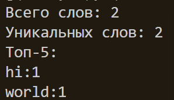

# Лабораторная работа 4
## Задание 1
### функции
```python
from pathlib import Path
import csv
from typing import Iterable, Sequence, Union 

def read_text(path: str | Path, encoding: str = "utf-8") -> str:
    #читает содержимое и возвращает его как 1 строку
    p = Path(path)
    if p.suffix.lower() != '.txt':
        raise ValueError('неправильный исходный формат не txt')
    try:
        return p.read_text(encoding=encoding)
    
    except FileNotFoundError:
        raise FileNotFoundError
    
    except UnicodeDecodeError:
        raise UnicodeDecodeError
```

```python
def write_csv(rows: list[tuple | list], path: str | Path, header: tuple[str, ...] | None = None) -> None:
    p = Path(path)

    if p.suffix.lower() != '.csv':
        raise ValueError('неправильный формат вывода не csv')
    
    rows = list(rows)
    #если нет заголовка бедем длину по 1 строчке
    if rows:
        if header is not None:
            expectlen = len(header)
        else:
            expectlen = len(rows[0])
        #проверяем все строки, enumerate просто идет по строкам
        for i, row in enumerate(rows):
            if len(row) != expectlen:
                raise ValueError
    # если есть заголовок
    if header is not None and rows:
        if len(header) != len(rows[0]):
            raise ValueError
    #шаблон
    with p.open("w", newline="", encoding="utf-8") as f:
        w = csv.writer(f)
        if header is not None:
            w.writerow(header)
        for r in rows:
            w.writerow(r)
```
при больших файлах читаем построчно, не переделывая все строки в список

```python
def write_csv(rows: Iterable[Sequence], path: str | Path,
              header: tuple[str, ...] | None = None) -> None:
    p = Path(path)
    with p.open("w", newline="", encoding="utf-8") as f:
        w = csv.writer(f)
        if header is not None:
            w.writerow(header)

        for r in rows:
            w.writerow(r)
```

### проверки на пустые файлы, ошкибки, другие форматы, А ТАКЖЕ НА ТО ЧТО WRITECSV ВОСПРИНИМЕТ ТОЛЬКО TXT И ВЫВОДИТ CSV
создаю файл и папку

```python
test_content = "Привет, мир! Привет!!!"
Path("data").mkdir(exist_ok=True)  # создаем папку data если её нет
Path("data/input.txt").write_text(test_content, encoding="utf-8")
```

чтение другой кодировки

```python
def read_text(path: str | Path, encoding: str = "cp1251") -> str:
    p = Path(path)
    return p.read_text(encoding=encoding)
strcp1251=(read_text("data/inputcp1251.txt",encoding='windows-1251'))
print(strcp1251)
```
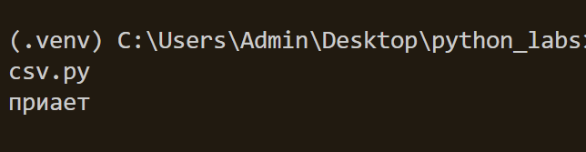

пустой txt, самый простой, ошибки

```python
str_empty=read_text("data/input_empty.txt")
print(str_empty)

strUTF=read_text("data/input.txt")
print(strUTF)

strcp1251_unicodeerror =(read_text("data/inputcp1251.txt",encoding='utf-32'))
print(strcp1251_unicodeerror)#UnicodeDecodeError

print(read_text("data/input_notfound.txt"))#FileNotFoundError
```

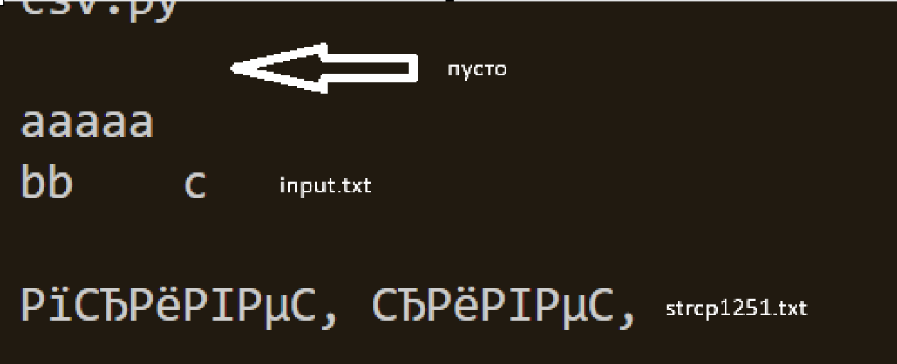
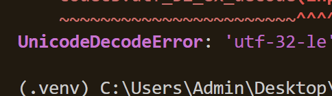
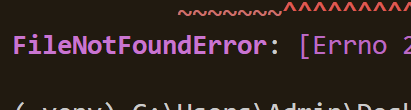

```python
a=read_text("data/json.json")
write_csv(a,'data/json2.csv')

a=read_text("data/input.txt")
write_csv(a,'data/json2.json')
```

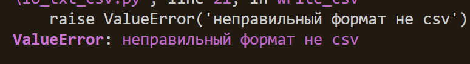
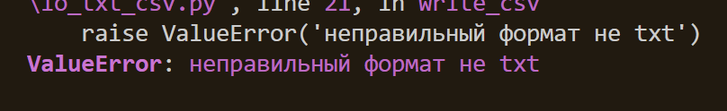

создание пустого ссв + заголовка, тест ссв с заголовком, ошибки длины

```python
write_csv([], "data/empty.csv", header=("пусто"))
write_csv([("word","count"),("test",3)], "data/check.csv")
write_csv([("word","count"),("test",3,"errorrr")], "data/checkvalueerror.csv")#valueerror
```
вывод в терминал ссв
```python
def print_csv(path):
    p=Path(path)
    #r это read
    with p.open('r', encoding='utf-8') as f:
        for line in f:
            print(line.strip()) 
print_csv("data/check.csv")
```
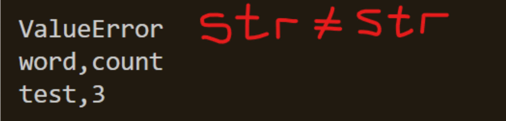

## Задание 2
```python
from text import normalize,tokenize
from collections import Counter
from io_txt_csv import write_csv, read_text

def frequencies_from_text(text: str) -> dict[str, int]:
    from text import normalize, tokenize
    tokens = tokenize(normalize(text))
    return Counter(tokens)  # dict-like

def sorted_word_counts(freq: dict[str, int]) -> list[tuple[str, int]]:
    return sorted(freq.items(), key=lambda kv: (-kv[1], kv[0]))
```
превратили в строки из нормализованых слов и частот 

```python
text=sorted_word_counts(frequencies_from_text(read_text("data/input.txt")))
write_csv(text, "data/report.csv", header=("word", "count"))
```
наш новый ссв

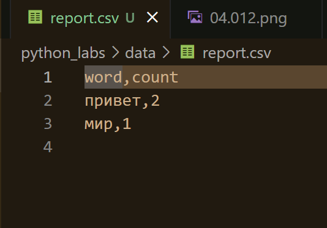

```python
inputt = read_text("data/input.txt")
tokens = (tokenize(normalize(inputt)))
dictt=Counter(tokens)
sorted_freq = sorted_word_counts(dictt)

print(f"Всего слов: {len(tokens)}")
print(f"Уникальных слов: {len(dictt)}")
print(f"Топ-5:")
for word, count in sorted_freq[:5]:
    print(f"{word}:{count}")
```
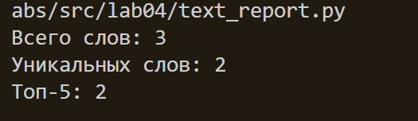

краевые случаи по типу не существует и пустой файл будут работать
# Лабораторная работа 5
## Задание 1

функция

```python

from pathlib import Path
import csv
import json  

def json_to_csv(json_path: str, csv_path: str) -> None:
    #проверка на формат входных и выходных данных
    p_json = Path(json_path)
    if p_json.suffix.lower() != '.json':
        raise ValueError('неправильный входной формат не json')
    p_csv = Path(csv_path)
    if p_csv.suffix.lower() != '.csv':
        raise ValueError('неправильный выходной формат не csv')
    #чтение json и проверка на существование, utf-8
    try:
        with p_json.open('r', encoding='utf-8') as f:
            list_dicts=json.load(f)
    except FileNotFoundError:
        raise FileNotFoundError
    except UnicodeDecodeError:
        raise UnicodeDecodeError
    except json.JSONDecodeError:
        raise ValueError("вообще пустой файл")
    #словари ли это
    for item in list_dicts:
        if not isinstance(item, dict):
            raise ValueError("не словари")
    #проверка на пустоту
    if len(list_dicts)==0:
        raise ValueError("пустой json типа {}")
    
    original_count = len(list_dicts)

    #поиск заголовков
    fieldnames = set()
    for item in list_dicts:
        fieldnames.update(item.keys())
    fieldnames = list(fieldnames)
    #записть csv
    with p_csv.open('w',encoding='utf-8', newline='') as f:
        #пустоты заполняем
        res=csv.DictWriter(f,fieldnames=fieldnames,restval='пусто')
        res.writeheader()
        for row in list_dicts:
            res.writerow(row)
    
    with p_csv.open('r', encoding='utf-8') as f:
            reader = csv.DictReader(f)
            csv_count = len(list(reader))
            if original_count != csv_count:
                raise ValueError("количество записей не совпало")

```

проверки

```python
#шаблонная запись и чтение
data = [{"name": "Alice", "age": 22}, {"name": "Bob", "age": 25}, {"name": "John"}]
path = Path("data/people.json")
with path.open('w', encoding='utf-8') as i:
    json.dump(data, i ,ensure_ascii=False, indent=2)
#база, пустой, не словарь, не сущ, не utf-8
json_to_csv("data/people.json", "data/people.csv")
json_to_csv("data/peopleempty.json", "data/people2.csv")
json_to_csv("data/peoplenotdict.json", "data/people2.csv")
json_to_csv("data/peoplenotexcist.json", "data/people2.csv")
json_to_csv("data/people1251.json", "data/people2.csv")
```
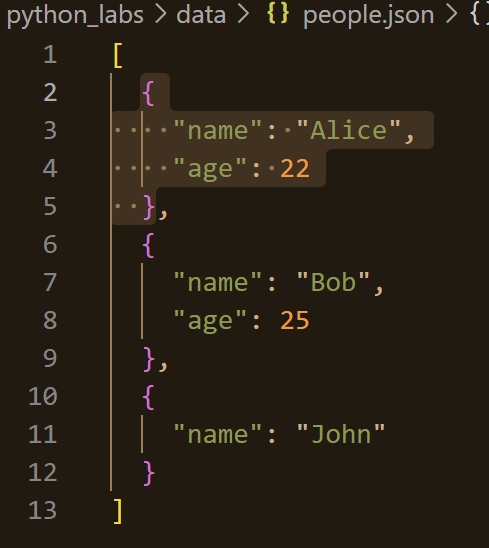
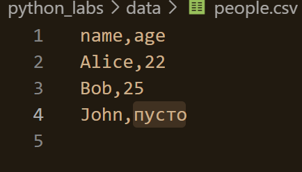

но если в файле будет {} или [] то тож ошибка

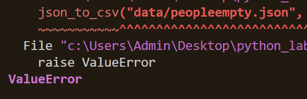
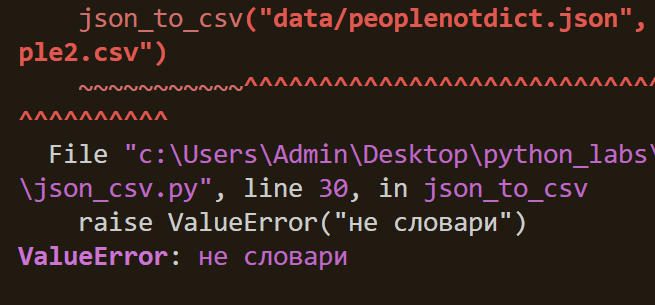
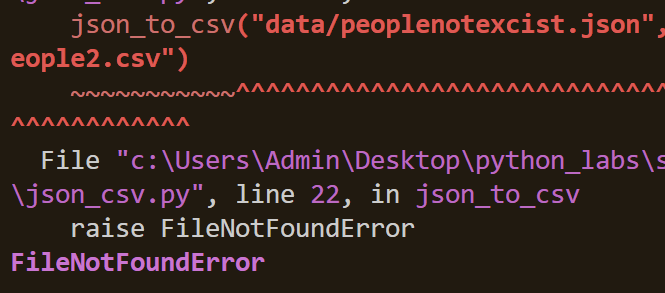
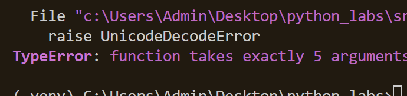
```python
def csv_to_json(csv_path: str, json_path: str) -> None:
    #проверка на формат входных и выходных данных
    p_csv = Path(csv_path)
    if p_csv.suffix.lower() != '.csv':
        raise ValueError('неправильный входной формат не csv')
    p_json = Path(json_path)
    if p_json.suffix.lower() != '.json':
        raise ValueError('неправильный выходной формат не json')
    try:
        with p_csv.open('r', encoding='utf-8') as f:
            #считает первую строку как заголовки
            reader = csv.DictReader(f)
            if not reader.fieldnames:
                raise ValueError('нет заголовка или пустой')
            data = [row for row in reader]
    except FileNotFoundError:
        raise FileNotFoundError
    except UnicodeDecodeError:
        raise UnicodeDecodeError
    with p_json.open('w',encoding='utf-8') as f:
        json.dump(data, f, ensure_ascii=False, indent=2)
    if len(json.load(p_json.open('r',encoding='utf-8')))!= len(data):
        raise ValueError("кол-во записей не совпало")

rows = [
    {"name": "Alice", "age": "22", "city": "SPB"},
    {"name": "Bob", "age": "25", "city": "Moscow"}
]
with open("data/peoplein.csv", "w", newline="", encoding="utf-8") as f:
    fieldnames = rows[0].keys()
    ress = csv.DictWriter(f, fieldnames=fieldnames)
    ress.writeheader()
    ress.writerows(rows)
csv_to_json("data/peoplein.csv","data/peopleout.json")
csv_to_json("data/peopleempty.csv", "data/people2.json")
csv_to_json("data/no_header.csv", "data/people2.json")
csv_to_json("data/peoplenotexcist.csv", "data/people2.json")
csv_to_json("data/people1251.csv", "data/people2.json")
```

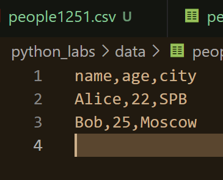
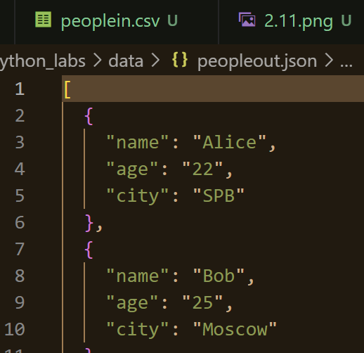
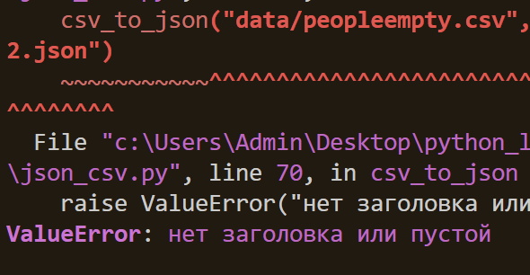
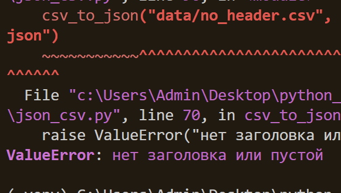
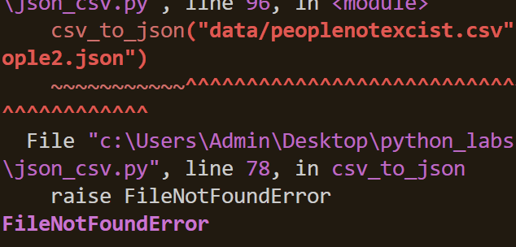
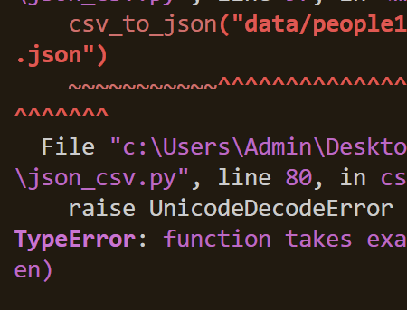
## Задание 2
```python
import csv
from pathlib import Path
import xlsxwriter

def csv_to_xlsx(csv_path: str, xlsx_path: str) -> None:
    p_csv = Path(csv_path) 
    if p_csv.suffix.lower() != '.csv':
        raise ValueError('неправильный входной формат не csv')
    p_xlsx = Path(xlsx_path)
    if p_xlsx.suffix.lower() != '.xlsx':
        raise ValueError('неправильный выходной формат не xlsx')
    try:
        with p_csv.open('r', encoding='utf-8') as f:
            reader = csv.reader(f)
            data = list(reader)
    except FileNotFoundError:
        raise FileNotFoundError
    except UnicodeDecodeError:
        raise UnicodeDecodeError
    if len(data) == 0:
        raise ValueError("пустой")
    original_count = len(data)
    # создание xlsx файла
    workbook = xlsxwriter.Workbook(xlsx_path)
    worksheet = workbook.add_worksheet("Sheet1")
    # автоширина колонок
    if data:
        #определяем макс длину из списков
        for col_idx in range(max(len(row) for row in data)):
            #макс значение по ячейкам из строки
            max_width = max(len(str(row[col_idx] if col_idx < len(row) else "")) for row in data)
            worksheet.set_column(col_idx, col_idx, max(8, max_width + 2))
    #запись данных в xlsx
    written_count = 0
    for row_idx, row in enumerate(data):
        for col_idx, value in enumerate(row):
            worksheet.write(row_idx, col_idx, value)
        written_count += 1
    #закрываем
    workbook.close()

    if original_count != written_count:
        raise ValueError("Количество записей не совпало")

csv_to_xlsx("data/people.csv", "data/people.xlsx")
csv_to_xlsx("data/peopleempty.csv", "data/people2.xlsx")
csv_to_xlsx("data/peoplenotexcist.csv", "data/people2.xlsx")
csv_to_xlsx("data/people1251.csv", "data/people2.xlsx")
```
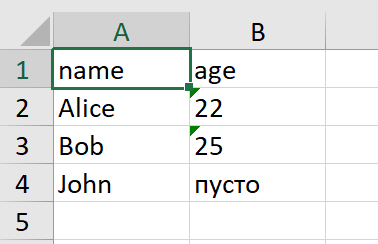
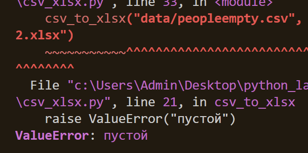
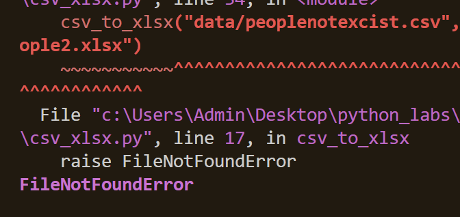
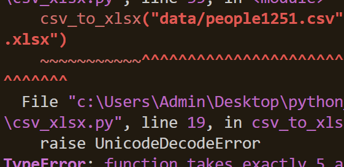

# Лабораторная работа 6
## код1

```python
import argparse
from lab03.text import tokenize, count_freq, top_n

def main():
    # создаем основу
    parser = argparse.ArgumentParser(description="CLI‑утилиты лабораторной №6")
    #создаю аргументы 
    subparsers = parser.add_subparsers(dest="command")

    # подкоманда cat - вывод файла построчно
    cat_parser = subparsers.add_parser("cat", help="Вывести содержимое файла")
    #аргуенты подкоманды input для получения и вывода без нумерации и n для нумерациии
    cat_parser.add_argument("--input", required=True, help="путь к файлу")
    cat_parser.add_argument("-n", action="store_true", help="Нумеровать строки")

    # подкоманда stats - анализ
    stats_parser = subparsers.add_parser("stats", help="Частоты слов")
    #аргументы input для получения файла и вывода всей статистики и top для топа..
    stats_parser.add_argument("--input", required=True, help="путь к файлу")
    stats_parser.add_argument("--top", type=int, default=5, help="топ слов")

    args = parser.parse_args()

    if args.command == "cat":
        try:
            with open(args.input, encoding="utf-8") as f:
            #нумеруем с 1 в формате номер: строка
                for i, line in enumerate(f, start=1):
                    if args.n:
                        print(f"{i}: {line.rstrip()}")
                    else:
                        print(line.rstrip())
        except FileNotFoundError:
            parser.error("файл не найден")
        except Exception as e:
            parser.error("ошибка при чтении файла")
        
    #
    elif args.command == "stats":
        try:
            with open(args.input, encoding="utf-8") as f:
                text = f.read()
            tokens = tokenize(text)
            freqs = count_freq(tokens)
            for word, count in top_n(freqs, args.top):
                print(f"{word}: {count}")
        except FileNotFoundError:
            parser.error(f"Файл '{args.input}' не найден")
        except Exception as e:
            parser.error(f"Ошибка при анализе файла: {e}")
    
    else:
        parser.print_help()
```
структура(?)


вывод строки cat


вывод топа stats


другой тип данных


## код2
```python
import argparse
import os
from json_csv import json_to_csv, csv_to_json
from csv_xlsx import csv_to_xlsx

def main():
    parser = argparse.ArgumentParser(description="Конвертеры данных")
    sub = parser.add_subparsers(dest="cmd")

    p1 = sub.add_parser("json2csv",help="json в csv")
    # подаргументы in и out для args входных и выходных
    p1.add_argument("--in", dest="input", required=True, help="путь для json")
    p1.add_argument("--out", dest="output", required=True, help="путь для csv")

    p2 = sub.add_parser("csv2json",help="путь csv в json")
    p2.add_argument("--in", dest="input", required=True,help="путь для csv")
    p2.add_argument("--out", dest="output", required=True,help="путь для json")

    p3 = sub.add_parser("csv2xlsx",help="путь csv в xlsx")
    p3.add_argument("--in", dest="input", required=True,help="путь для csv")
    p3.add_argument("--out", dest="output", required=True,help="путь для xlsx")

    args = parser.parse_args()
    #проверка входного файла
    if not os.path.exists(args.input):
        parser.error("входной файл не найден.")

    #выполнение подкоманд
    try:
        #если команда такая то такая то, то из 5 лабы
        if args.cmd == "json2csv":
            json_to_csv(args.input, args.output)
        elif args.cmd == "csv2json":
            csv_to_json(args.input, args.output)
        elif args.cmd == "csv2xlsx":
            csv_to_xlsx(args.input, args.output)
        print(f"Успешно: {args.input} -> {args.output}")
    except Exception as e:
        parser.error("ошибка при конвертации")

if __name__ == "__main__":
    main()
```

json в csv

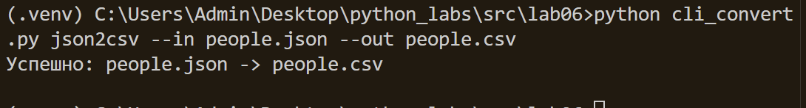


csv в json (без фото там также)


csv в xlsx 


# Лабораторная работа 7

# тестики на текст
```python
import pytest
from src.lab03.text import normalize, tokenize, count_freq, top_n

# NORMALIZE


@pytest.mark.parametrize(
    "source, expected",
    [
        # кириллица, спецсимволы
        ("ПрИвЕт\nМИр\t", "привет мир"),
        # буква ё
        ("ёжик, Ёлка", "ежик елка"),
        # латиница, спецсимволы
        ("Hello\r\nWorld", "hello world"),
        # лишние пробелы
        ("  двойные   пробелы  ", "двойные пробелы"),
        # пустая строка
        ("", ""),
        # только спецсимволы
        ("!@#$%^&*()", ""),
        # цифры
        ("Test123 Numbers456", "test numbers"),
        # смешанный случай
        ("Mixed Test!", "mixed test"),
    ],
)
def test_normalize_basic(source, expected):
    assert normalize(source) == expected


# TOKENIZE
@pytest.mark.parametrize(
    "source, expected",
    [
        # базовый случай
        ("привет мир тест", ["привет", "мир", "тест"]),
        # одно слово
        ("один", ["один"]),
        # пустая строка
        ("", []),
        # только пробелы
        ("   \t\n  ", []),
        # лишние пробелы
        ("  два   слова  ", ["два", "слова"]),
        # латиница
        ("hello world test", ["hello", "world", "test"]),
    ],
)
def test_tokenize_basic(source, expected):
    assert tokenize(source) == expected


@pytest.mark.parametrize(
    "tokens, expected",
    [
        # базовый случай
        (["привет", "мир", "привет"], {"привет": 2, "мир": 1}),
        # пустой список
        ([], {}),
        # одно слово
        (["слово"], {"слово": 1}),
        # повторения
        (["a", "a", "a", "a"], {"a": 4}),
        # на английском
        (["hello", "world", "hello"], {"hello": 2, "world": 1}),
    ],
)
def test_count_freq(tokens, expected):
    assert count_freq(tokens) == expected


@pytest.mark.parametrize(
    "freq_dict, n, expected",
    [
        # базовый случай
        ({"привет": 3, "мир": 2, "тест": 1}, 2, [("привет", 3), ("мир", 2)]),
        # n больше чем количество слов
        ({"привет": 3, "мир": 2}, 5, [("привет", 3), ("мир", 2)]),
        # n = 0
        ({"привет": 3, "мир": 2}, 0, []),
        # пустой словарь
        ({}, 3, []),
        # одно слово
        ({"слово": 5}, 1, [("слово", 5)]),
    ],
)
def test_top_n_basic(freq_dict, n, expected):
    assert top_n(freq_dict, n) == expected
```

# тестики на преобразование файлов

tmp_path: Path - временная директория, создаваемая pytest


```python
import pytest
import json
import csv
from pathlib import Path
from src.lab05.json_csv import json_to_csv, csv_to_json

# БАЗА


def test_json_to_csv_roundtrip(tmp_path: Path):
    src = tmp_path / "people.json"
    dst = tmp_path / "people.csv"
    data = [
        {"name": "Alice", "age": 22},
        {"name": "Bob", "age": 25},
    ]
    src.write_text(json.dumps(data, ensure_ascii=False, indent=2), encoding="utf-8")
    json_to_csv(str(src), str(dst))

    with dst.open(encoding="utf-8") as f:
        rows = list(csv.DictReader(f))

    assert len(rows) == 2
    assert {"name", "age"} <= set(rows[0].keys())


def test_csv_to_json_roundtrip(tmp_path: Path):
    src = tmp_path / "data.csv"
    dst = tmp_path / "data.json"

    csv_data = [
        {"name": "Alice", "age": "22", "city": "Moscow"},
        {"name": "Bob", "age": "25", "city": "London"},
    ]

    with src.open("w", encoding="utf-8", newline="") as f:
        writer = csv.DictWriter(f, fieldnames=["name", "age", "city"])
        writer.writeheader()
        writer.writerows(csv_data)
    csv_to_json(str(src), str(dst))

    with dst.open(encoding="utf-8") as f:
        result_data = json.load(f)

    assert len(result_data) == 2
    assert result_data[0]["name"] == "Alice"
    assert result_data[1]["age"] == 25  # Должно преобразоваться в число


# ПУСТЫЕ
def test_json_to_csv_empty_json(tmp_path: Path):
    src = tmp_path / "empty.json"
    dst = tmp_path / "empty.csv"

    src.write_text("[]", encoding="utf-8")

    with pytest.raises(ValueError, match="пустой json"):
        json_to_csv(str(src), str(dst))


def test_csv_to_json_empty_csv(tmp_path: Path):
    src = tmp_path / "empty.csv"
    dst = tmp_path / "empty.json"

    src.write_text("", encoding="utf-8")

    with pytest.raises(ValueError, match="нет заголовка или пустой"):
        csv_to_json(str(src), str(dst))


# НА ФОРМАТЫ


def test_json_to_csv_wrong_input_format(tmp_path: Path):
    src = tmp_path / "data.txt"
    dst = tmp_path / "data.csv"

    src.write_text("some text", encoding="utf-8")

    with pytest.raises(ValueError, match="неправильный входной формат не json"):
        json_to_csv(str(src), str(dst))


def test_json_to_csv_wrong_output_format(tmp_path: Path):
    src = tmp_path / "data.json"
    dst = tmp_path / "data.txt"

    src.write_text("[]", encoding="utf-8")

    with pytest.raises(ValueError, match="неправильный выходной формат не csv"):
        json_to_csv(str(src), str(dst))


def test_csv_to_json_wrong_input_format(tmp_path: Path):

    src = tmp_path / "data.txt"
    dst = tmp_path / "data.json"

    src.write_text("some text", encoding="utf-8")

    with pytest.raises(ValueError, match="неправильный входной формат не csv"):
        csv_to_json(str(src), str(dst))


def test_csv_to_json_wrong_output_format(tmp_path: Path):
    src = tmp_path / "data.csv"
    dst = tmp_path / "data.txt"

    with src.open("w", encoding="utf-8", newline="") as f:
        writer = csv.DictWriter(f, fieldnames=["name"])
        writer.writeheader()

    with pytest.raises(ValueError, match="неправильный выходной формат не json"):
        csv_to_json(str(src), str(dst))


# НЕ СУЩЕСТВУЕТ


def test_csv_to_json_file_not_found():
    with pytest.raises(FileNotFoundError):
        csv_to_json("nonexistent.csv", "output.json")


def test_json_to_csv_file_not_found():
    with pytest.raises(FileNotFoundError):
        json_to_csv("nonexistent.json", "output.csv")


# КОЛВО ЗАПИСЕЙ СОВПАДАЕТ
def test_json_to_csv_record_count(tmp_path: Path):
    src = tmp_path / "people.json"
    dst = tmp_path / "people.csv"
    data = [
        {"name": "Alice", "age": 22},
        {"name": "Bob", "age": 25},
        {"name": "Charlie", "age": 30},
    ]
    src.write_text(json.dumps(data, ensure_ascii=False, indent=2), encoding="utf-8")
    json_to_csv(str(src), str(dst))

    with dst.open(encoding="utf-8") as f:
        rows = list(csv.DictReader(f))

    assert len(rows) == 3


def test_csv_to_json_record_count(tmp_path: Path):
    src = tmp_path / "data.csv"
    dst = tmp_path / "data.json"

    csv_data = [
        {"name": "Alice", "age": "22"},
        {"name": "Bob", "age": "25"},
        {"name": "Charlie", "age": "30"},
        {"name": "David", "age": "35"},
    ]

    with src.open("w", encoding="utf-8", newline="") as f:
        writer = csv.DictWriter(f, fieldnames=["name", "age"])
        writer.writeheader()
        writer.writerows(csv_data)
    csv_to_json(str(src), str(dst))

    with dst.open(encoding="utf-8") as f:
        result_data = json.load(f)

    assert len(result_data) == 4


# ПРОВЕРКА ЗАГОЛОВКОВ
def test_json_to_csv_field_names(tmp_path: Path):
    src = tmp_path / "people.json"
    dst = tmp_path / "people.csv"
    data = [
        {"name": "Alice", "age": 22, "city": "Moscow"},
        {"name": "Bob", "age": 25, "city": "London"},
    ]
    src.write_text(json.dumps(data, ensure_ascii=False, indent=2), encoding="utf-8")
    json_to_csv(str(src), str(dst))

    with dst.open(encoding="utf-8") as f:
        rows = list(csv.DictReader(f))

    assert set(rows[0].keys()) == {"name", "age", "city"}


def test_csv_to_json_field_names(tmp_path: Path):
    src = tmp_path / "data.csv"
    dst = tmp_path / "data.json"

    csv_data = [
        {"name": "Alice", "age": "22", "city": "Moscow", "country": "Russia"},
        {"name": "Bob", "age": "25", "city": "London", "country": "UK"},
    ]

    with src.open("w", encoding="utf-8", newline="") as f:
        writer = csv.DictWriter(f, fieldnames=["name", "age", "city", "country"])
        writer.writeheader()
        writer.writerows(csv_data)
    csv_to_json(str(src), str(dst))

    with dst.open(encoding="utf-8") as f:
        result_data = json.load(f)

    assert set(result_data[0].keys()) == {"name", "age", "city", "country"}
```

все тесты прошли


# стиль тоже супер


# pyproject 

```python
[build-system]
requires = ["setuptools >= 77.0.3"] # зависимости
build-backend = "setuptools.build_meta" # сборка 

[project]
name = "python-labs" # имя 
dynamic = ["version"] # версия

dependencies = [
    "pandas>=2.2", # библиотека анализа данных
    "openpyxl>=3.0", # библиотека для экселя
]

[project.optional-dependencies]
dev = [
    "pytest>=8.0", # для тестирования
    "pytest-cov>=5.0", # для покрытия 
    "black>=24.0", # для стиля
    "ruff>=0.6" # для проверки
]

[tool.black]
line-length = 88 # макс длина строки
target-version = ["py38"] # синтаксис питона версии 3.8
```

# Лабораторная работа 8

## коды
``` python
from dataclasses import dataclass
from datetime import datetime, date


@dataclass
class Student:
    fio: str
    birthdate: str
    group: str
    gpa: float

    def __post_init__(self):

        if not isinstance(self.fio, str):
            raise TypeError(f"не str")
        if not isinstance(self.birthdate, str):
            raise TypeError(f"не str")
        if not isinstance(self.group, str):
            raise TypeError(f"не str")
        if not isinstance(self.gpa, (int, float)):
            raise TypeError(f"не float")

        try:
            datetime.strptime(self.birthdate, "%Y-%m-%d")
        except ValueError:
            raise ValueError(
                f"неверный формат даты: '{self.birthdate}' ожидается YYYY-MM-DD"
            )

        if not (0 <= self.gpa <= 5):
            raise ValueError(f"GPA {self.gpa} должен быть от 0 до 5")

    def age(self) -> int:
        birth_date = datetime.strptime(self.birthdate, "%Y-%m-%d").date()
        today = date.today()
        age = today.year - birth_date.year

        if (today.month, today.day) < (birth_date.month, birth_date.day):
            age -= 1

        return age

    def to_dict(self) -> dict:
        return {
            "fio": self.fio,
            "birthdate": self.birthdate,
            "group": self.group,
            "gpa": self.gpa,
        }

    @classmethod
    def from_dict(cls, d: dict):
        required_fields = ["fio", "birthdate", "group", "gpa"]
        for field in required_fields:
            if field not in d:
                raise ValueError(f"Отсутствует обязательное поле: {field}")

        return cls(
            fio=d["fio"], birthdate=d["birthdate"], group=d["group"], gpa=d["gpa"]
        )

    def __str__(self):
        return f"Студент: {self.fio}, Группа: {self.group}, GPA: {self.gpa:.2f}, Возраст: {self.age()} лет"
```

```python
import json
from typing import List
from pathlib import Path
from .models import Student


def students_to_json(students: List[Student], path: str) -> None:
    if not students:
        raise ValueError("список студентов не может быть пустым")

    if not isinstance(students, list):
        raise TypeError(f"ожидается список")

    for student in students:
        if not isinstance(student, Student):
            raise TypeError

    try:
        data = [student.to_dict() for student in students]
    except Exception as e:
        raise ValueError(f"Ошибка при преобразовании студентов: {e}")

    file_path = Path(path)
    file_path.parent.mkdir(parents=True, exist_ok=True)

    with open(path, "w", encoding="utf-8") as f:
        json.dump(data, f, ensure_ascii=False, indent=2)


def students_from_json(path: str) -> List[Student]:
    if not Path(path).exists():
        raise FileNotFoundError(f"файл не найден")
    
    try:
        with open(path, "r", encoding="utf-8") as f:
            data = json.load(f)
    except json.JSONDecodeError:
        raise json.JSONDecodeError
    except UnicodeDecodeError:
        raise ValueError(f"не json")

    if not isinstance(data, list):
        raise ValueError

    students = []
    for item in data:
        if not isinstance(item, dict):
            raise ValueError(f"не словарь")
        
        student = Student.from_dict(item)
        students.append(student)
    return students
```

проверки

при попытке неправильной записи без какогото аргумента выводится ошибка, она идет перед postinit, поэтому я её не трогала
```python
student3 = Student(
    fio="Петрова Анна Сергеевна",
    birthdate="2001-08-22",
    group="AI-03",

)
```

```python
import sys
import os
sys.path.insert(0, os.path.join(os.path.dirname(__file__), 'src'))

from lab08.models import Student
from lab08.serialize import students_to_json, students_from_json

print("базовый студент:")
student1 = Student(
    fio="Иванов Иван Иванович",
    birthdate="2000-05-15",
    group="SE-01",
    gpa=4.2
)
print(f"{student1}")

print("\nТест to_dict/from_dict:")
student_dict = student1.to_dict()
print(f"to_dict: {student_dict}")
student_from_dict = Student.from_dict(student_dict)
print(f"from_dict: {student_from_dict}")

# print("\nGPA")
# Student(
#     fio="Петрова Анна",
#     birthdate="2001-08-22",
#     group="AI-03",
#     gpa="zkzkz"
# )

# print("\nGPA")
# Student(
#     fio="Петрова Анна",
#     birthdate="2001-08-22",
#     group="AI-03",
#     gpa=6.0
# )

# print("\nнеправильная дата")
# Student(
#     fio="Сидоров Алексей",
#     birthdate="2001/08/22",
#     group="CS-02",
#     gpa=3.5
# )

print("\nсериализация:")
student2 = Student(
    fio="Петрова Анна Сергеевна",
    birthdate="2001-08-22",
    group="AI-03",
    gpa=4.8
)

students_to_json([student1, student2], "data/lab08/students_output.json")
print("ура JSON")

print("\nдесериализация:")
loaded = students_from_json("data/lab08/students_output.json")

for s in loaded:
    print(f"{s}")
```


