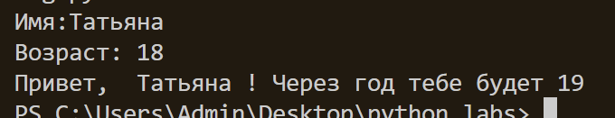
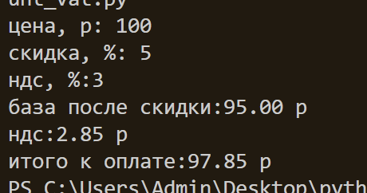
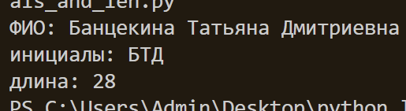
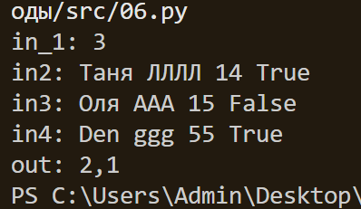

# python_labs

# Лабораторная работа 1
## Задание 1
```python
a=input("Имя:")
b=int(input("Возраст: "))
c=b+1
print(f"Привет, ",a,"! Через год тебе будет",c)
```

## Задание 2
```python
a=input('a: ')
a=a.replace(',','.')
a=float(a)
b=input('b: ')
b=b.replace(',','.')
b=float(b)
print(f"sum={a+b}; avg={(a+b)/2:.2f}")
```

## Задание 3
```python
price=float(input('цена, р: '))
discount=float(input('скидка, %: '))
vat=float(input('ндс, %:'))
base = price * (1 - discount/100)
vat_amount = base * (vat/100)
total = base + vat_amount
print(f"база после скидки:{base:.2f} р")
print(f"ндс:{vat_amount:.2f} р")
print(f"итого к оплате:{total:.2f} р")
```

## Задание 4
```python
m=int(input("минуты: "))
print(f"{m//60}:{m-(60*(m//60)):02d}")
```

## Задание 5
```python
name=str(input("ФИО: "))
print(f"инициалы: {(name.split()[0])[0]}{(name.split()[1])[0]}{(name.split()[2])[0]}")
print(f"длина: {len(name)}")
```

## Задание 6
```python
n=int(input('in_1: '))
k=1
och=0
zao=0
for i in range(n):
    k+=1
    name1, name2,voz , obu = (input(f'in{k}: ')).split()
    if obu=="True":
        och+=1
    else:
        zao+=1
print(f'out: {och},{zao}')
```
