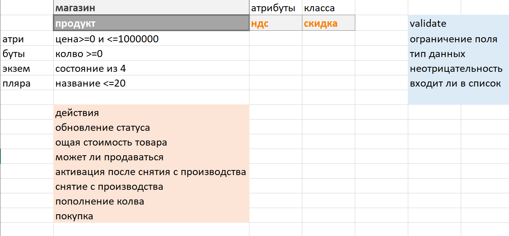

# python_labs

# Вариант 3

# Лабораторная работа 1

В моём варианте моей задачей было реализовать работу класса через интернет-магазин. Объектом класса я выбрала товар, потому что у него есть много примеров атрибутов и свойств, бизнес-методов и т.д.




**Класс** - Product

**Защищённые атрибуты экземпляра** - имя, цена, состояние и кол-во на складе.
## Управление доступом через @property

Состояние экземпляра контролируем через @property:
- **Геттер (@property)** - контролируем чтение
- **Сеттер (@price.setter)** - контролируем изменение с проверками

Геттеры я сделала для всех атрибутов, чтобы можно было получить их значения. Сеттер сделала только для цены, потому что цена может меняться.

## Атрибуты класса

**Атрибуты класса** - скидка и ндс

## Валидация (файл validate.py)

В файле Validate я вынесла все проверки через @classmetod, такие как:
- **Проверка типа данных** 
- **Проверка диапазона** 
- **Проверка допустимых значений** (статус должен быть из списка)

## Магические методы

**Магические методы:**
- **`__str__`** - красивый вывод для пользователя

- **`__repr__`** - вывод для разработчика

- **`__eq__`** - сравнение товаров

## Бизнес-методы

**Бизнес методы:**
- **общая стоимость товара** (`total_value()`)
- **проверка возможности продажи** (`can_be_sold()`)
- **покупка** (`purchase()`)
- **пополнение запасов** (`restock()`)
- **снятие с производства** (`discontinue()`)
- **возврат в продажу** (`activate()`)

## Логическое состояние

**Логическое состояние:**
- **обновление статуса наличия** (`_update_status()`)


## DEMO
```python
Демонстрация работы класса Product (вариант 3)
Аргументы: name, price, amount, status

Создание объектов:

ТОВАР 1:
Товар: Ноутбук
Цена: 75,000.00 руб.
Количество: 10 шт.
Статус: В наличии

ТОВАР 2:
Товар: Смартфон
Цена: 25,000.00 руб.
Количество: 0 шт.
Статус: Нет в наличии

ТОВАР 3:
Товар: Планшет
Цена: 50,000.00 руб.
Количество: 5 шт.
Статус: Предзаказ

ТОВАР 4:
Товар: Плеер
Цена: 5,000.00 руб.
Количество: 2 шт.
Статус: Снят с производства

__repr__:
repr(product1): Product('Ноутбук', 75000, 10, 'in_stock')
repr(product2): Product('Смартфон', 25000, 0, 'out_of_stock')

Атрибуты класса:
Скидка по умолчанию: 5.0%
НДС: 20.0%
Скидка по умолчанию экземпляра: 5.0%

ИЗМЕНЕНИЕ АТРИБУТА КЛАССА:
Старая скидка: 5.0%
Новая скидка: 10.0%

НОВЫЙ ТОВАР (с новой скидкой):
Товар: Мышь
Цена: 3,000.00 руб.
Количество: 15 шт.
Статус: В наличии

РАБОТА С СЕТТЕРОМ (изменение цены):
Текущая цена product1: 75000 руб.
цена изменена: 75000 руб. -> 80000 руб.
Новая цена product1: 80000 руб.

ТОВАР ПОСЛЕ ИЗМЕНЕНИЯ ЦЕНЫ:
Товар: Ноутбук
Цена: 80,000.00 руб.
Количество: 10 шт.
Статус: В наличии

Проверка setter (валидация через Validator):
попытка установить отрицательную цену:
Ошибка: цена не может быть отрицательной

попытка установить слишком большую цену:
Ошибка: цена не может быть больше 1000000

попытка установить цену строкой:
Ошибка: цена должна быть числом

Вывод пользователю с __str__:
Товар: Ноутбук
Цена: 80,000.00 руб.
Количество: 10 шт.
Статус: В наличии
Товар: Смартфон
Цена: 25,000.00 руб.
Количество: 0 шт.
Статус: Нет в наличии

Сравнение c __eq__:
product1 (Ноутбук) == product5 (Ноутбук): True
product1 (Ноутбук) == product6 (Электронные часы): False
product1 == product1 (тот же объект): True

БИЗНЕС-МЕТОД total_value():
Товар: Ноутбук
Цена: 80000 руб. * 10 шт. = 800000 руб.

Товар: Смартфон
Цена: 25000 руб. × 0 шт. = 0 руб.

Товар: Плеер (снят с производства)
Общая стоимость: 0.00 руб. (не продается)

БИЗНЕС-МЕТОД can_be_sold():
Товар: Ноутбук
товар доступен для продажи

Товар: Смартфон
товара нет в наличии

Товар: Планшет
товар доступен для продажи

Товар: Плеер
товар снят с производства

ФОРМАТИРОВАНИЕ:
Товар:
Товар: Супер комп
Цена: 999,999.00 руб.
Количество: 10000 шт.
Статус: В наличии

МЕТОДЫ ИЗМЕНЕНИЯ СОСТОЯНИЯ:

СОЗДАН ТЕСТОВЫЙ ТОВАР:
Товар: Телефон
Цена: 50,000.00 руб.
Количество: 3 шт.
Статус: В наличии

МЕТОД DISCONTINUE (снятие с производства):
Текущий товар:
Товар: Телефон
Цена: 50,000.00 руб.
Количество: 3 шт.
Статус: В наличии

Снимаем с производства:
внимание: на складе осталось 3 шт. товара 'Телефон'
товар 'Телефон' снят с производства
ТОВАР ПОСЛЕ СНЯТИЯ:
Товар: Телефон
Цена: 50,000.00 руб.
Количество: 3 шт.
Статус: Снят с производства

МЕТОД ACTIVATE (возврат в продажу):
Текущий товар (снят с производства):
Товар: Телефон
Цена: 50,000.00 руб.
Количество: 3 шт.
Статус: Снят с производства
товар 'Телефон' возвращен в продажу
ТОВАР ПОСЛЕ АКТИВАЦИИ:
Товар: Телефон
Цена: 50,000.00 руб.
Количество: 3 шт.
Статус: В наличии

МЕТОД RESTOCK (пополнение запасов):
Текущий товар (снят с производства):
Товар: Телефон
Цена: 50,000.00 руб.
Количество: 3 шт.
Статус: В наличии

Пытаемся пополнить запасы:
запас товара 'Телефон' пополнен на 5 шт.
ТОВАР ПОСЛЕ ПОПОЛНЕНИЯ:
Товар: Телефон
Цена: 50,000.00 руб.
Количество: 8 шт.
Статус: В наличии

СОЗДАЕМ НОВЫЙ ТОВАР ДЛЯ RESTOCK:
Товар: Наушники
Цена: 5,000.00 руб.
Количество: 2 шт.
Статус: В наличии

Пополняем запасы (рабочий случай):
запас товара 'Наушники' пополнен на 10 шт.
ТОВАР ПОСЛЕ ПОПОЛНЕНИЯ:
Товар: Наушники
Цена: 5,000.00 руб.
Количество: 12 шт.
Статус: В наличии

МЕТОД PURCHASE (покупка товара):
Текущий товар:
Товар: Наушники
Цена: 5,000.00 руб.
Количество: 12 шт.
Статус: В наличии

Покупаем 3 шт.:
куплено 3 шт. товара 'Наушники' на сумму 15000 руб.
Сумма покупки: 15000 руб.
ТОВАР ПОСЛЕ ПОКУПКИ:
Товар: Наушники
Цена: 5,000.00 руб.
Количество: 9 шт.
Статус: В наличии

Покупаем ещё 10 шт. (больше чем есть):
Ошибка: невозможно купить: недостаточно товара. Доступно: 9

ТОВАР ПОСЛЕ ПОКУПКИ:
Товар: Наушники
Цена: 5,000.00 руб.
Количество: 9 шт.
Статус: В наличии

ДЕМОНСТРАЦИЯ СЦЕНАРИЕВ РАБОТЫ:

СЦЕНАРИЙ 1: НОРМАЛЬНАЯ ПОКУПКА
Начальное состояние:
Товар: Книга
Цена: 1,500.00 руб.
Количество: 5 шт.
Статус: В наличии

Покупка 2 шт.:
куплено 2 шт. товара 'Книга' на сумму 3000 руб.
Сумма покупки: 3000 руб.

Состояние после покупки:
Товар: Книга
Цена: 1,500.00 руб.
Количество: 3 шт.
Статус: В наличии

СЦЕНАРИЙ 2: ПОПЫТКА КУПИТЬ БОЛЬШЕ, ЧЕМ ЕСТЬ
Текущее количество: 3 шт.
Попытка купить 10 шт.:
Ошибка: невозможно купить: недостаточно товара. Доступно: 3

СЦЕНАРИЙ 3: РАБОТА СО СНЯТЫМ С ПРОИЗВОДСТВА ТОВАРОМ
Товар:
Товар: Плеер
Цена: 3,000.00 руб.
Количество: 1 шт.
Статус: Снят с производства

Попытка купить:
Ошибка: невозможно купить: товар снят с производства

Попытка изменить цену:
Ошибка: нельзя изменить цену товара, снятого с производства

ОШИБКИ ВАЛИДАЦИИ ПРИ СОЗДАНИИ (через Validator):

Попытка: тип названия
Ошибка: название должно быть строкой

Попытка: пустое название
Ошибка: название не может быть пустым

Попытка: слишком длинное название
Ошибка: название не может быть длиннее 20 символов

Попытка: отрицательная цена
Ошибка: цена не может быть отрицательной

Попытка: цена слишком большая
Ошибка: цена не может быть больше 1000000

Попытка: цена не число
Ошибка: цена должна быть числом

Попытка: отрицательное количество
Ошибка: количество не может быть отрицательным

Попытка: количество не целое число
Ошибка: количество должно быть целым числом

Попытка: некорректный статус
Ошибка: статус должен быть одним из: ['in_stock', 'out_of_stock', 'discontinued', 'preorder']

Ошибка: цена должна быть числом

Попытка: отрицательное количество
Ошибка: количество не может быть отрицательным

Попытка: количество не целое число
Ошибка: цена должна быть числом
Ошибка: цена должна быть числом

Попытка: отрицательное количество
Ошибка: количество не может быть отрицательным

Попытка: количество не целое число
Ошибка: количество должно быть целым числом

Попытка: некорректный статус
Ошибка: статус должен быть одним из: ['in_stock', 'out_of_stock', 'discontinued', 'preorder']

Попытка: статус не строка
Ошибка: статус должен быть строкой


