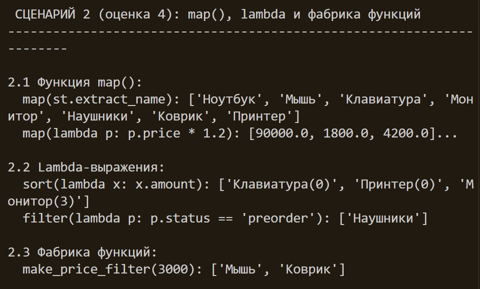

# Лабораторная работа №5
## Функции как аргументы. Стратегии и делегаты (Python)

## Реализованные функции-стратегии и обработчики

| Категория | Функция/Стратегия | Назначение |
|-----------|-------------------|------------|
| **Сортировка** | `by_name(item)` | Сортировка по названию товара |
| | `by_price(item)` | Сортировка по цене |
| | `by_amount(item)` | Сортировка по количеству на складе |
| | `by_price_then_name(item)` | Составная сортировка (цена → имя) |
| | `by_status_priority(item)` | Сортировка по приоритету статуса |
| **Фильтрация** | `is_expensive(item)` | Товары дороже порога (1000 руб.) |
| | `is_cheap(item)` | Товары дешевле порога (500 руб.) |
| | `is_in_stock(item)` | Товары в наличии |
| | `is_available_for_purchase(item)` | Товары, доступные для покупки |
| **Преобразование** | `extract_name(item)` | Извлечение имени |
| | `extract_price(item)` | Извлечение цены |
| | `to_short_string(item)` | Короткое строковое представление |
| | `apply_percent_discount(percent)` | Применение процентной скидки |

---

## Описание реализованных концепций

### 1. Передача функций как аргументов

Методы `sort_by(key_func)` и `filter_by(predicate)` в классе `ProductCatalog` принимают функции-стратегии для динамического изменения поведения.

#### Сортировка по переданной стратегии
catalog.sort_by(by_price)/catalog.sort_by(by_name)             

#### Фильтрация по переданному предикату
catalog.filter_by(is_in_stock)/catalog.filter_by(is_expensive)      

### 2. Функции высшего порядка
- map() — преобразование коллекци

- filter() — фильтрация коллекции

- sorted() — сортировка с ключом

### 3. lambda-выражения

Для простых, одноразовых операций:
python

- lambda для сортировки - catalog.sort_by(lambda x: x.price, reverse=True)

- lambda для фильтрации - filtered = list(filter(lambda x: 1000 < x.price < 10000, items))

- lambda в map - names = list(map(lambda x: x.name, items))

### 4. Фабрики функций (замыкания)

Функции, создающие другие функции с заданными параметрами:
- make_price_filter(max_price)	Создаёт фильтр по максимальной цене	
- make_amount_filter(min_amount)	Создаёт фильтр по минимальному количеству	
- make_discount_applier(discount_percent)	Создаёт функцию применения скидки	
### 5. Паттерн «Стратегия» через callable-объекты

Классы-стратегии, реализующие метод __call__():
- SortByNameStrategy	возвращает item.name	Стратегия сортировки по имени
- SortByPriceStrategy	возвращает item.price	Стратегия сортировки по цене
- SortByCompositeStrategy	возвращает (price, name)	Составная стратегия
- InStockFilterStrategy	возвращает bool	Стратегия фильтрации по наличию
- CheapFilterStrategy	возвращает bool	Стратегия фильтрации по дешевизне
- DiscountStrategy	возвращает price × (1 - discount)	Стратегия расчёта скидки

### 6. Цепочки операций (Fluent Interface)

Класс ChainWrapper позволяет строить цепочки операций:

Доступные методы цепочки:

- filter_by(predicate) — фильтрация

- sort_by(key_func, reverse) — сортировка

- apply(func) — применение функции ко всем элементам

- map_to(func) — преобразование в список

- get_result() — получение результата

- to_catalog() — преобразование обратно в ProductCatalog

### 7. Методы расширения коллекции ProductCatalog

- sort_by(key_func, reverse)	Сортировка по ключевой функции
- filter_by(predicate)	Фильтрация по предикату	
- apply(func)	Применение функции ко всем элементам	
- map_to(func)	Преобразование в список результатов	
- copy()	Создание поверхностной копии	
- deep_copy()	Создание глубокой копии	

## Сценарий 1 — Функции сортировки и фильтрации

Что демонстрируется:

   Три стратегии сортировки: по цене, по имени, составная (цена → имя)
   Две функции фильтрации: товары в наличии и дорогие товары
   Встроенная функция filter() с lambda и именованными функциями
](<../../img/2sem/image copy.png>)

## Сценарий 2 — map(), lambda и фабрика функций

Что демонстрируется:

    Функция map() с именованными функциями и lambda
    Lambda-выражения в сортировке, фильтрации и преобразовании
    Фабрика функций make_price_filter() для создания фильтров

## Сценарий 3 — Паттерн Стратегия и цепочки операций

Что демонстрируется:

    Callable-объекты: SortByNameStrategy, CheapFilterStrategy, DiscountStrategy
    Метод apply() для применения функции ко всем элементам
    Цепочка операций filter_by() → sort_by() → apply()
    Замена стратегии сортировки без изменения кода коллекции
](<../../img/2sem/image copy 19.png>)

